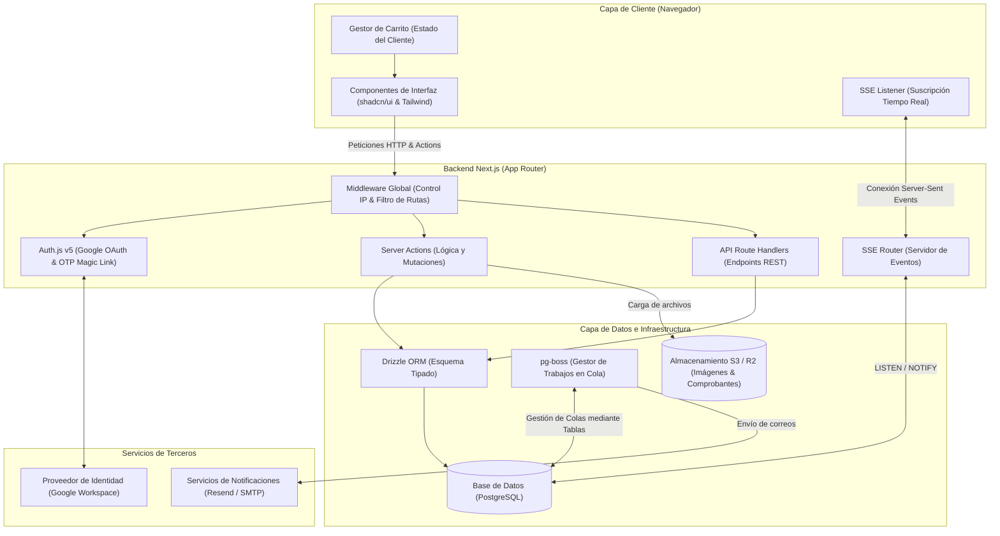

# Arquitectura — Ágora Campus

Este documento detalla la arquitectura de **Ágora Campus**, la plataforma de comercio electrónico cerrado y social para la comunidad de la Universidad Politécnica de Yucatán (UPY).

---

## 1. Diagrama de componentes

El siguiente diagrama ilustra la arquitectura de componentes de la aplicación, organizada en capas de presentación, backend/servicios, datos y servicios externos.



---

## 2. Stack tecnológico

La selección del stack tecnológico prioriza la compatibilidad nativa, la velocidad de desarrollo y el alojamiento rentable:

| Componente | Tecnología | Razón y propósito |
| :--- | :--- | :--- |
| **Framework Web** | Next.js 14+ (App Router, RSC, TS) | Aprovechamiento de Server Components para tiempos de carga inmediatos, Server Actions para seguridad/mutaciones simplificadas y API Route Handlers para endpoints de integración. |
| **Base de datos** | PostgreSQL | Robustez relacional, soporte para transacciones ACID críticas para reservas de stock, y compatibilidad con JSONB para almacenamiento flexible de metadatos de reglas. |
| **ORM** | Drizzle ORM | Mapeo tipado en tiempo de compilación. Generación rápida de esquemas basados en TypeScript y menor latencia en consultas en comparación con ORMs tradicionales. |
| **Autenticación** | Auth.js v5 (NextAuth) | Autenticación integrada a nivel de servidor con Google OAuth para el correo institucional (`@upy.edu.mx`) y enlaces mágicos (OTP) como alternativa de respaldo gratuita. |
| **Diseño / UI** | TailwindCSS + shadcn/ui | Estilo responsivo y consistente mediante tokens de diseño personalizables. Componentes accesibles (Radix) modificados para dispositivos móviles. |
| **Colas de Trabajo** | `pg-boss` | Motor de colas de tareas asíncronas de alto rendimiento que corre directamente sobre PostgreSQL, evitando la necesidad de mantener Redis o RabbitMQ adicionales. |
| **Almacenamiento** | S3 / Cloudflare R2 | Almacenamiento descentralizado y económico para las imágenes de catálogo de productos y, críticamente, los archivos adjuntos de comprobantes SPEI. |
| **Tiempo Real** | PostgreSQL `LISTEN`/`NOTIFY` + SSE | Infraestructura ligera para actualizar contadores de drops en tiempo real sin abrir WebSockets bidireccionales complejos. |

---

## 3. Decisiones de arquitectura (ADR)

### ADR-01: Aislamiento lógico multivendedor en base de datos única
* **Contexto:** La plataforma debe alojar múltiples tiendas (facultades, clubes, emprendimientos independientes) pero operar de forma unificada.
* **Decisión:** Usar un esquema de base de datos relacional único. El aislamiento se logra a nivel lógico mediante la columna `vendor_id` presente en las entidades principales (`products`, `orders`, `drops`).
* **Consecuencias:** Simplificación de consultas, migraciones centralizadas y posibilidad de realizar carritos de compra mixtos (multi-vendedor). Requiere filtros estrictos en las consultas para evitar fugas de datos.

### ADR-02: Pagos descentralizados sin custodia de fondos
* **Contexto:** Integrar una pasarela de pago formal (Stripe, Openpay) introduce costos transaccionales, retrasos en la dispersión y cargas regulatorias/legales complejas para la universidad.
* **Decisión:** El dinero viaja directamente del comprador a la clave CLABE declarada por cada vendedor. La plataforma actúa como testigo documental recolectando comprobantes de transferencia SPEI y gestionando el estado de la verificación.
* **Consecuencias:** Cero custodia de fondos por parte de la plataforma. La conciliación es manual y recae en el vendedor, lo que requiere un sistema robusto de estados para mitigar fraudes.

### ADR-03: Reservas de stock temporal basadas en TTL (`stock_holds`)
* **Contexto:** En un sistema de pagos manuales, hay un desfase entre la intención de compra (creación del pedido) y la validación del pago. Mantener el inventario comprometido indefinidamente causaría sobreventas o bloqueos maliciosos de stock.
* **Decisión:** Implementar reservas temporales en la tabla `stock_holds` asociadas a una orden. Tienen un tiempo de vida (TTL) de 24 a 48 horas.
* **Consecuencias:** Si el comprador no sube el comprobante antes de la expiración, la orden pasa a `expirado` y el stock se libera automáticamente mediante un job programado.

### ADR-04: Pagos diferidos en compras grupales por aula
* **Contexto:** Las compras grupales requieren que se alcance un umbral mínimo de unidades para desbloquear precios con descuento. Solicitar transferencias individuales inmediatas y luego tener que reembolsar en caso de no alcanzar la meta genera una carga operativa inviable.
* **Decisión:** Los participantes se comprometen a la compra grupal, pero los datos de pago y solicitud de comprobante SPEI se gatillan e inician **únicamente** cuando la meta es alcanzada y el grupo se declara como completado.
* **Consecuencias:** Cero flujos de reembolso por metas no alcanzadas. El período de pago se concentra en una ventana reducida post-validación.

---

## 4. Seguridad y acceso

### Autenticación
El sistema utiliza **Auth.js v5** para restringir el acceso exclusivamente a los usuarios de la comunidad UPY:
1. **Google OAuth:** Configurado para restringir los inicios de sesión al dominio institucional configurable (por ejemplo, `*@upy.edu.mx` o dominios de alumnos).
2. **OTP por Correo (Magic Links):** Método alternativo seguro para usuarios autorizados sin acceso OAuth, enviando tokens de un solo uso con validez máxima de 15 minutos.

### Gate por IP / CIDR
Para asegurar que ciertas operaciones ocurran exclusivamente dentro del campus físico (por ejemplo, las ventas en efectivo en el punto de entrega físico):
* Un **Middleware de Next.js** intercepta las solicitudes entrantes.
* Lee la dirección IP del cliente a través de cabeceras seguras como `X-Forwarded-For` (configurándose detrás de un Proxy inverso confiable).
* Realiza una validación matemática de coincidencia contra rangos CIDR (ejemplo: `192.168.1.0/24`) almacenados en la tabla `ip_rules`.
* Si `IP_GATE_ENABLED` está activo, se restringen los scopes definidos:
  * `global`: Bloqueo de entrada total a la tienda desde fuera del campus.
  * `admin` / `vendor`: Solo permite modificar estados y validar pagos/entregas en efectivo desde la red institucional.

---

## 5. Pagos manuales y conciliación

El ciclo de vida del pago está diseñado para automatizar y agilizar la verificación manual:

```
[Cliente realiza orden] 
   --> Estado del pedido: PENDIENTE_PAGO | Se genera Referencia Única de pago.
   --> Cliente transfiere por SPEI a la CLABE del vendedor y sube captura.
   --> Estado del pedido: COMPROBANTE_ENVIADO | El pago pasa a estado ENVIADO.
   --> Vendedor valida en su panel y estado de cuenta bancario.
         |--> Aprobado: Pedido -> PAGO_VERIFICADO / Pago -> VERIFICADO
         |--> Rechazado: Pedido -> PENDIENTE_PAGO (Reintento de subida) / Pago -> RECHAZADO
```

### Mecanismos clave:
* **Referencia Única:** Cada pedido tiene una cadena alfanumérica única que el comprador debe colocar en el "Concepto de pago" de la transferencia.
* **Cola de verificación del vendedor:** Los vendedores disponen de una vista centralizada donde ven los comprobantes (imágenes en S3) y la referencia esperada para aprobar o rechazar de forma rápida.
* **OCR de Comprobantes (Fase 2):** Integración con la API de Claude Vision para extraer automáticamente el emisor, la cuenta, el monto y la referencia del archivo adjunto y cruzarlo con el pedido, pre-marcando discrepancias y reduciendo el fraude con capturas falsas.

---

## 6. Trabajos en segundo plano (jobs)

Para mantener una interfaz rápida y evitar retrasos en las peticiones de los usuarios, las tareas pesadas y temporales se delegan a **`pg-boss`**:

1. **Expirador de Stock Holds:** Corre periódicamente buscando órdenes en estado `pendiente_pago` cuyo `expira_en` sea menor a la hora actual. Cambia el estado a `expirado` y libera los inventarios asociados.
2. **Notificaciones Transaccionales:** Los envíos de correos (Resend) o alertas de WhatsApp se encolan para evitar retrasar el hilo principal de renderizado de la UI.
3. **Monitoreo de Drops:** Despierta eventos para iniciar o cerrar automáticamente las campañas de *drops* basándose en la fecha programada, actualizando la disponibilidad de productos en el frontend.
4. **Cierre de Compras Grupales:** Monitorea la fecha límite de las compras grupales abiertas. Si expira el tiempo sin alcanzar el umbral de unidades, cancela el grupo y notifica a los participantes; si se cumple la meta, cambia el estado a completado y notifica para proceder al pago.

---

## 7. Tiempo real (drops)

Para campañas de alta demanda (*drops*) y compras grupales activas, la plataforma implementa una infraestructura de tiempo real de bajo consumo:

* **Emisión de Eventos:** En el backend, las mutaciones clave (compra de un artículo del drop, unión a compra grupal) realizan un trigger en base de datos o ejecutan un comando `pg_notify(canal, payload)`.
* **Transporte (SSE):** Un *Route Handler* dedicado (`/api/drops/live` o `/api/group-buys/live`) mantiene un flujo de conexión abierto (**Server-Sent Events**) con los navegadores de los clientes. Escucha el canal mediante `LISTEN` en PostgreSQL y reenvía el payload JSON.
* **Frontend reactivo:** Los clientes se suscriben al canal de eventos, permitiendo actualizar la cuenta regresiva, la barra de progreso de la compra grupal y el nivel de stock en tiempo real sin forzar recargas del sitio (polling).

---

## 8. Escalabilidad y despliegue

### Requisitos del servidor
* **Entorno VPS / Docker:** Se recomienda desplegar en una máquina virtual o contenedor autohospedado dentro del campus o en una infraestructura en la nube (como Render/Railway) que permita configurar adecuadamente los proxies.
* **Configuración del Proxy:** Es fundamental habilitar el parámetro `trust proxy` en el servidor Node.js/Next.js para que el framework capture la dirección IP real de la cabecera `X-Forwarded-For` y no la IP local de balanceadores de carga como Nginx o Cloudflare.

### Rendimiento de Base de Datos
* **Indexación clave:** Se configuran índices compuestos en las tablas con consultas frecuentes por tienda: `idx_products_vendor` (`vendor_id`, `status`), `idx_orders_vendor` (`vendor_id`, `status`), e índices únicos sobre la referencia de pago en `orders` y `payments`.
* **Pool de conexiones:** Para entornos serverless o de alta concurrencia, se recomienda integrar un gestor de pool como **PgBouncer** para evitar el agotamiento de sockets de base de datos debido a múltiples invocaciones simultáneas de Server Actions.
