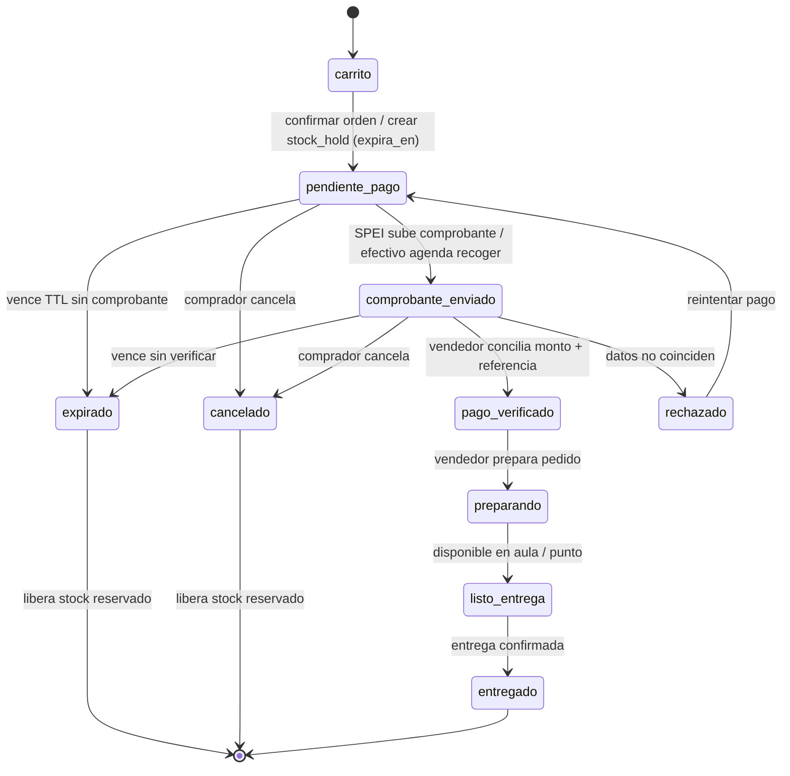
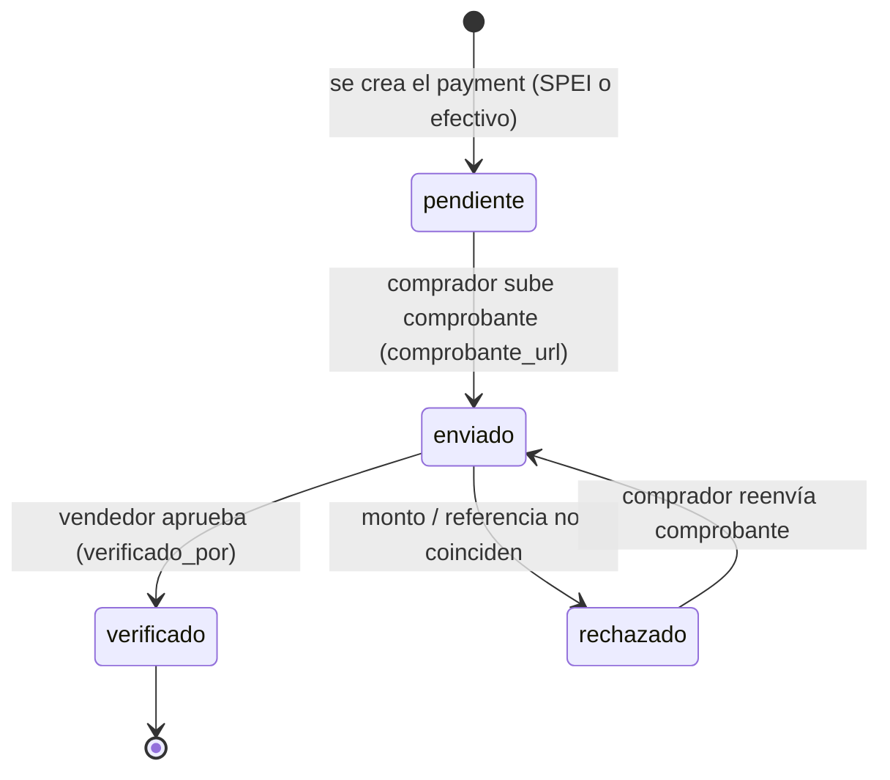

# Diagrama Entidad–Relación (ERD) — Ágora Campus

Este documento describe el **modelo de datos** de *Ágora Campus*, el marketplace interno y social de la comunidad universitaria. El esquema está pensado para **PostgreSQL** y se define con **Drizzle ORM** (dividido por dominio bajo `src/db/schema`). Es un sistema **multivendedor de inquilino único**: no hay una base de datos por tienda, sino aislamiento lógico **a nivel de fila** mediante la columna `vendor_id`. Las claves primarias (`id`) son `uuid` por convención; los importes monetarios usan `numeric` (precisión exacta, sin redondeos de coma flotante); las marcas de tiempo son `timestamptz`; y los catálogos de estado se modelan como `enum` de Postgres. Como la plataforma **no custodia fondos**, no existen tablas de saldos ni de dispersión: el dinero viaja directo a la **CLABE** de cada vendedor y la conciliación de comisiones se hace por fuera.

El diagrama siguiente cubre las 24 entidades del modelo, sus atributos principales y todas las relaciones (con claves primarias `PK`, claves foráneas `FK` y cardinalidades). Las dos secciones finales documentan la **máquina de estados del pedido** y la del **pago**, que son el corazón operativo del sistema de pagos manuales.

---

## Diagrama entidad–relación

```mermaid
erDiagram
    institutions ||--o{ users : "agrupa"
    users ||--o{ accounts : "tiene"
    users ||--o{ sessions : "abre"

    users ||--o{ vendor_members : "es miembro"
    vendors ||--o{ vendor_members : "tiene miembros"

    vendors ||--o{ products : "publica"
    products ||--o{ product_variants : "se vende como"
    product_variants ||--|| inventory : "controla stock"
    product_variants ||--o{ stock_holds : "reserva"

    users ||--o{ orders : "compra"
    vendors ||--o{ orders : "recibe"
    orders ||--o{ order_items : "contiene"
    product_variants ||--o{ order_items : "se incluye en"
    orders ||--o{ payments : "paga con"
    orders ||--o{ stock_holds : "reserva mediante"

    vendors ||--o{ drops : "lanza"
    drops ||--o{ drop_products : "incluye"
    products ||--o{ drop_products : "aparece en"

    products ||--o{ preorders : "se preventa como"
    product_variants ||--o{ waitlists : "tiene lista de espera"

    products ||--o{ group_buys : "se compra en grupo"
    group_buys ||--o{ group_buy_members : "agrupa a"
    users ||--o{ group_buy_members : "participa en"
    payments ||--o| group_buy_members : "respalda"

    users ||--o{ wishlists : "crea"
    wishlists ||--o{ wishlist_collaborators : "se comparte con"
    users ||--o{ wishlist_collaborators : "colabora en"

    users ||--o{ follows : "sigue"
    vendors ||--o{ follows : "es seguido por"

    users ||--o{ notifications : "recibe"
    users ||--o{ audit_log : "actor de"

    institutions {
        uuid id PK
        text nombre
        jsonb dominios
        jsonb config
        timestamp created_at
    }

    users {
        uuid id PK
        uuid institution_id FK
        text email
        text nombre
        text rol_global "enum: superadmin|vendor|comprador|cajero"
        timestamp verificado_en
        timestamp email_verified
        text image
        timestamp created_at
    }

    accounts {
        uuid id PK
        uuid user_id FK
        text provider
        text provider_account_id
        text type
        text access_token
        text refresh_token
        int expires_at
    }

    sessions {
        uuid id PK
        uuid user_id FK
        text session_token
        timestamp expires
    }

    vendors {
        uuid id PK
        text slug
        text nombre
        text tipo "enum: facultad|club|emprendimiento"
        text clabe
        text estado "enum: pendiente|aprobado|suspendido"
        numeric comision_pct
        timestamp created_at
    }

    vendor_members {
        uuid id PK
        uuid vendor_id FK
        uuid user_id FK
        text rol "enum: owner|staff"
        timestamp created_at
    }

    products {
        uuid id PK
        uuid vendor_id FK
        text nombre
        text descripcion
        text estado "enum: borrador|publicado|agotado|archivado"
        text tipo "enum: fisico|preventa|drop"
        jsonb imagenes
        timestamp created_at
    }

    product_variants {
        uuid id PK
        uuid product_id FK
        text sku
        jsonb atributos "talla, color"
        numeric precio
        numeric precio_comunidad
        bool activo
    }

    inventory {
        uuid id PK
        uuid variant_id FK
        int stock
        int reservado
        timestamp updated_at
    }

    stock_holds {
        uuid id PK
        uuid variant_id FK
        uuid order_id FK
        int cantidad
        timestamp expira_en
        timestamp created_at
    }

    orders {
        uuid id PK
        uuid comprador_id FK
        uuid vendor_id FK
        text estado "enum estados del pedido"
        numeric total
        text referencia_pago
        text metodo_entrega "enum: aula|punto"
        text aula
        timestamp expira_en
        timestamp created_at
    }

    order_items {
        uuid id PK
        uuid order_id FK
        uuid variant_id FK
        int cantidad
        numeric precio_unit
    }

    payments {
        uuid id PK
        uuid order_id FK
        text metodo "enum: efectivo|spei"
        text referencia
        text comprobante_url
        numeric monto_declarado
        text estado "enum: pendiente|enviado|verificado|rechazado"
        uuid verificado_por FK
        timestamp created_at
    }

    drops {
        uuid id PK
        uuid vendor_id FK
        text titulo
        timestamp inicia_en
        timestamp termina_en
        int stock_total
        jsonb reglas
        timestamp created_at
    }

    drop_products {
        uuid id PK
        uuid drop_id FK
        uuid product_id FK
    }

    preorders {
        uuid id PK
        uuid product_id FK
        int meta_unidades
        timestamp fecha_limite
        text estado "enum: abierta|cumplida|cancelada"
        timestamp created_at
    }

    waitlists {
        uuid id PK
        uuid variant_id FK
        uuid user_id FK
        timestamp creado_en
    }

    group_buys {
        uuid id PK
        uuid product_id FK
        uuid lider_id FK
        text aula
        int meta_cantidad
        timestamp fecha_limite
        text estado "enum: abierta|cumplida|expirada|cancelada"
        timestamp created_at
    }

    group_buy_members {
        uuid id PK
        uuid group_buy_id FK
        uuid user_id FK
        uuid payment_id FK
        int cantidad
        timestamp created_at
    }

    wishlists {
        uuid id PK
        uuid user_id FK
        text nombre
        bool publica
        timestamp created_at
    }

    wishlist_collaborators {
        uuid id PK
        uuid wishlist_id FK
        uuid user_id FK
        text rol "enum: editor|lector"
    }

    follows {
        uuid id PK
        uuid user_id FK
        uuid vendor_id FK
        timestamp created_at
    }

    notifications {
        uuid id PK
        uuid user_id FK
        text tipo
        jsonb payload
        bool leido
        timestamp created_at
    }

    ip_rules {
        uuid id PK
        text scope "enum: global|admin|vendor"
        text cidr
        text accion "enum: allow|deny"
        int prioridad
        bool activo
    }

    audit_log {
        uuid id PK
        uuid actor_id FK
        text accion
        text entidad
        jsonb antes
        jsonb despues
        timestamp ts
    }
```

---

## Leyenda y notas

- **Cardinalidades.** En la notación de Mermaid `||` significa "uno y solo uno", `o{` significa "cero o muchos" y `o|` "cero o uno". Así, `vendors ||--o{ products` se lee "un vendedor publica cero o muchos productos, y cada producto pertenece a exactamente un vendedor".
- **Aislamiento multivendedor por `vendor_id`.** No hay una base de datos por tienda: todo convive en un solo Postgres y la separación es **a nivel de fila**. Las entidades de venta cuelgan de `vendors` directa o indirectamente (`products`, `drops`, `orders`) y portan `vendor_id`. Toda consulta de un vendedor debe filtrar por su `vendor_id`, y se recomienda reforzarlo con *Row-Level Security* (RLS) y/o un *guard* en la capa de datos para impedir que una tienda lea o modifique datos de otra.
- **Cuentas y sesiones (`accounts`, `sessions`).** Son las tablas estándar que requiere el **adaptador de Drizzle de Auth.js v5**. `accounts` guarda el vínculo con el proveedor OAuth (Google) por usuario; `sessions` guarda las sesiones activas. Ambas dependen de `users` (1—N) y se borran en cascada con el usuario.
- **Pagos directos a la CLABE del vendedor.** La plataforma **no custodia fondos**. Cada `vendors.clabe` es la cuenta destino real del dinero. Al crear un `payment` SPEI se le asigna una `referencia` única (que el comprador usa como concepto de la transferencia) y un `monto_declarado`; la conciliación es **manual**: el vendedor compara contra su estado de cuenta y marca `verificado` o `rechazado` (registrando `verificado_por`). No existen tablas de balance, *payout* ni *split* porque el dinero nunca pasa por la plataforma; la comisión universitaria (`vendors.comision_pct`) se concilia por separado.
- **Relación `stock_holds` ↔ `orders` (reservar-luego-pagar).** Cuando se crea una orden en `pendiente_pago` se genera uno o varios `stock_holds`, cada uno apuntando a la `order` (`order_id`) y a la variante (`variant_id`) con una `cantidad` y un `expira_en`. Esto **reserva** unidades (incrementa `inventory.reservado`) mientras el pago manual está pendiente, evitando sobreventa. Si el pago se verifica, el *hold* se consume (sale de `reservado` y baja `stock`); si la orden **expira o se cancela**, los *holds* se liberan y `reservado` vuelve a bajar, devolviendo las unidades al disponible. Un job en segundo plano (pg-boss) recorre los `stock_holds` vencidos para expirar órdenes y liberar stock.
- **Compras grupales y pagos.** En `group_buys` el cobro ocurre **solo al alcanzar la meta**: cada `group_buy_members` se enlaza a su propio `payment` (relación cero-o-uno: el `payment_id` se llena cuando el participante paga su parte por SPEI). Esto evita reembolsos masivos —dolorosos sin pasarela— porque nadie transfiere hasta que la compra grupal se confirma.
- **Entidades independientes.** `ip_rules` no tiene FK: alimenta el *gate* por IP del middleware (campos `scope`, `cidr`, `accion`, `prioridad` tal como los consume `src/lib/ip-rules.ts`). `audit_log` es transversal y solo referencia al **actor** (`actor_id → users`); guarda `antes`/`despues` como `jsonb` para auditar cualquier entidad sin acoplarse a ellas.

---

## Máquina de estados del pedido

Refleja el flujo de pago manual (SPEI con comprobante o efectivo en punto de entrega). El estado vive en `orders.estado`. Las reservas (`stock_holds`) se crean al entrar en `pendiente_pago` y se liberan al `expirado`/`cancelado`.

**Notas de transición**

- `carrito → pendiente_pago`: se crea la orden, se genera `referencia_pago` y `expira_en`, y se reservan unidades con `stock_holds`.
- `rechazado → pendiente_pago`: el pago no cuadró; la orden vuelve a estar pendiente y el comprador puede reintentar (nuevo comprobante) mientras no expire la reserva.
- `expirado` y `cancelado`: estados terminales que **liberan el stock reservado** (bajan `inventory.reservado`).
- `pago_verificado → preparando → listo_entrega → entregado`: tramo de cumplimiento; por defecto la entrega es **en el aula del vendedor** (o en un punto), alineado con las compras grupales por aula.

---

## Estados de pago

El estado vive en `payments.estado` y avanza en paralelo a la orden. Su catálogo (`enum`) es `pendiente | enviado | verificado | rechazado`, exactamente como lo consumen los endpoints `POST /api/payments/comprobante` y `POST /api/payments/[paymentId]/verificar`.

**Notas**

- `pendiente → enviado`: al subir el comprobante se guarda `comprobante_url` (objeto en S3/R2) y `monto_declarado`.
- `enviado → verificado | rechazado`: la verificación es **humana** (cola del vendedor), comparando monto exacto y referencia única contra su estado de cuenta; al verificar se registra `verificado_por`. En V2, OCR con Claude Vision pre-marca discrepancias.
- `rechazado → enviado`: el comprador puede **reenviar** un comprobante corregido sin reabrir la orden completa.
- Cuando un `payment` llega a `verificado`, la orden asociada transiciona a `pago_verificado`; si se `rechaza`, la orden vuelve a `pendiente_pago`.
